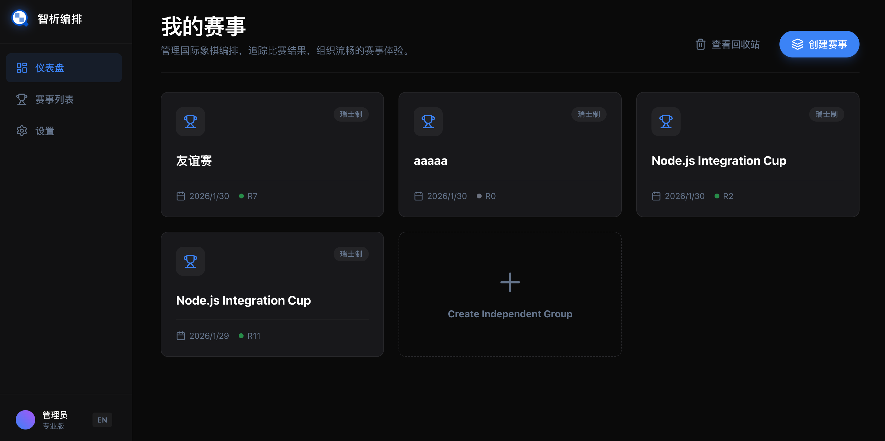

# 智析编排 (ZXPairing)

[English](./README.md)

<p align="center">
  
  
  
  
</p>

> Professional like FIDE, Simple like a Game.

智析编排是一个专业的国际象棋比赛编排系统，支持瑞士制（Swiss System）和循环赛（Round Robin）两种赛制。系统采用三端协同架构，满足从个人赛事到正式比赛的多样化需求。

## 特性

- **FIDE 标准算法**: 基于 bbpPairings (C++) 实现，符合国际象棋联合会编排标准
- **双赛制支持**: 瑞士制 & 循环赛，满足不同规模赛事需求
- **现代化 Web 管理后台**: Vue 3 + Tailwind CSS，界面美观，操作便捷
- **RESTful API**: 前后端分离设计，易于扩展和集成
- **国际化支持**: 中文/英文双语界面

## 界面预览

| 页面 | 说明 |
|------|------|
|  | 赛事列表 - 创建和管理比赛 |
|  | 选手管理 - 添加选手、查看对阵表 |
|  | 排名榜 - 实时积分排名 |
|  | 设置 - 语言切换 |

## 系统架构

```
┌─────────────────────────────────────────────────────────────┐
│                        PC Web (Vue 3)                       │
│                   管理后台 / 大屏展示                         │
└─────────────────────────┬───────────────────────────────────┘
                          │ HTTP API
                          ▼
┌─────────────────────────────────────────────────────────────┐
│                    Server (Node.js + Fastify)               │
│                   业务逻辑 / 数据库管理                       │
└─────────────────────────┬───────────────────────────────────┘
                          │ HTTP
                          ▼
┌─────────────────────────────────────────────────────────────┐
│                   Engine (Python + FastAPI)                │
│              编排算法 / 对阵计算 (瑞士制/循环赛)               │
└─────────────────────────────────────────────────────────────┘
```

## 快速开始

### 前置要求

- Node.js 20+
- Python 3.10+
- bbpPairings 二进制文件 (见下文)
- (可选) uv - Python 包管理工具

### 1. 克隆项目

```bash
git clone https://github.com/your-repo/zxpairing.git
cd zxpairing
```

### 2. 启动计算引擎 (Engine)

详情见 [engine/README.md](./engine/README.md)

```bash
cd engine

# 使用 uv (推荐)
uv venv
source .venv/bin/activate
uv pip install -r requirements.txt
uv run uvicorn main:app --reload

# 或使用 pip
python -m venv .venv
source .venv/bin/activate
pip install -r requirements.txt
uvicorn main:app --reload
```

引擎服务默认运行在 `http://127.0.0.1:8000`

### 3. 启动后端服务 (Server)

```bash
cd server

# 安装依赖
npm install

# 复制环境配置
cp .env.example .env

# 初始化数据库
npx prisma generate
npx prisma db push

# 启动开发服务器
npm run dev
```

后端服务默认运行在 `http://localhost:3001`

### 4. 启动 Web 前端

```bash
cd web

# 安装依赖
npm install

# 启动开发服务器
npm run dev
```

前端默认运行在 `http://localhost:5173`

### 5. 配置 bbpPairings

bbpPairings 是 FIDE 标准的瑞士制对阵计算引擎。

1. 从 [bbpPairings Releases](https://github.com/BieremaBoyzProgramming/bbpPairings/releases) 下载对应系统的版本
2. 将二进制文件放入系统路径或 `engine/` 目录
3. 确保已安装 `libstdc++`

| 平台 | 文件 |
|------|------|
| Windows | `.exe` / `.dll` |
| macOS | `.dylib` |
| Linux | `.so` |

## 项目结构

```
zxpairing/
├── engine/                 # Python 计算引擎
│   ├── main.py            # FastAPI 服务入口
│   ├── pairing_algorithms/
│   │   ├── swiss.py       # 瑞士制算法
│   │   └── round_robin.py # 循环赛算法
│   ├── requirements.txt
│   └── README.md
│
├── server/                 # Node.js 后端服务
│   ├── src/
│   │   └── index.ts       # 主服务入口 (Express/Fastify)
│   ├── prisma/
│   │   └── schema.prisma  # 数据库模型
│   ├── package.json
│   └── .env.example
│
├── web/                    # Vue 3 Web 管理后台
│   ├── src/
│   │   ├── views/         # 页面组件
│   │   │   ├── Dashboard.vue
│   │   │   ├── TournamentDetail.vue
│   │   │   └── Settings.vue
│   │   ├── api/           # API 客户端
│   │   ├── components/   # 通用组件
│   │   └── locales/       # 国际化文件
│   ├── package.json
│   └── vite.config.ts
│
├── docs/                   # 项目文档
│   ├── architecture.md     # 架构设计
│   ├── prd.md              # 产品需求
│   └── roadmap.md          # 开发路线
│
├── miniprogram/            # 微信小程序 (开发中)
└── README.md
```

## 技术栈

| 层级 | 技术 | 说明 |
|------|------|------|
| 前端框架 | Vue 3 + Composition API | 现代化前端框架 |
| UI 组件 | Tailwind CSS | 原子化 CSS |
| 后端框架 | Fastify | 高性能 Node.js 框架 |
| 数据库 | Prisma + SQLite | ORM + 开发数据库 |
| 计算引擎 | Python + FastAPI | 编排算法服务 |
| 核心算法 | bbpPairings (C++) | FIDE 标准瑞士制 |

## API 概览

| 方法 | 路径 | 说明 |
|------|------|------|
| GET | `/api/tournaments` | 获取赛事列表 |
| POST | `/api/tournaments` | 创建赛事 |
| GET | `/api/tournaments/:id` | 获取赛事详情 |
| POST | `/api/tournaments/:id/pair` | 生成下一轮对阵 |
| PUT | `/api/matches/:id` | 更新对局结果 |
| DELETE | `/api/tournaments/:id/rounds/latest` | 回滚最新轮次 |

详细 API 文档可启动服务后访问 `http://localhost:8000/docs` (Engine) 查看 Swagger 文档。

## 常见问题

### Q: 如何处理奇数选手？

系统会自动为瑞士制比赛安排轮空（Bye），轮空选手获得 1 分。

### Q: 支持哪些赛制？

- **瑞士制 (Swiss)**: 适用于 8 人以上比赛，采用积分编排
- **循环赛 (Round Robin)**: 适用于 4-12 人比赛，每人对阵一次

### Q: 如何接入微信登录？

当前版本尚未集成微信登录功能。有两种方式扩展：
1. 在 server 中添加微信 OAuth 流程
2. 使用第三方身份认证服务

### Q: 支持手机端吗？

微信小程序正在开发中。目前可通过浏览器在移动设备上使用 Web 版本。

## 贡献指南

欢迎提交 Issue 和 Pull Request！

1. Fork 本仓库
2. 创建功能分支 (`git checkout -b feature/amazing-feature`)
3. 提交更改 (`git commit -m 'Add some amazing feature'`)
4. 推送分支 (`git push origin feature/amazing-feature`)
5. 打开 Pull Request

## License

MIT License - 详见 [LICENSE](LICENSE) 文件

## 鸣谢

- [bbpPairings](https://github.com/BieremaBoyzProgramming/bbpPairings) - FIDE 标准瑞士制算法
- [py4swiss](https://github.com/py4swiss/py4swiss) - Python 封装库
- [Vue](https://vuejs.org/) - 渐进式前端框架
- [Fastify](https://www.fastify.io/) - 高性能 Web 框架
